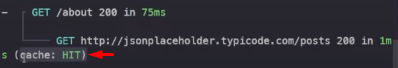
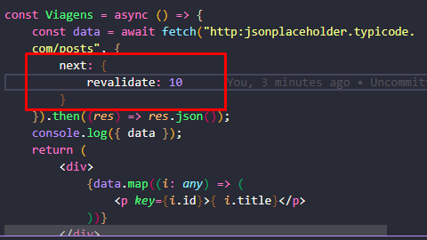
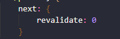
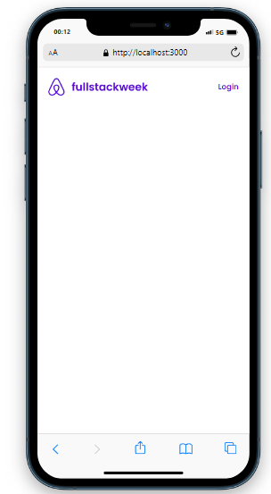

# Anotações

* Tudo que está dentro da pasta ```app/``` é uma rota.
* o arquivo {layout.tsx} dentro de ```app/layout.tsx``` contém tudo que vai ficar em volta das páginas que vão se redenizadas.
    - Também é possível criar layouts para rotas específicas como foi feito no commit anterior : ```cfbe1b967100b64475df13f08bdb270d57a20dc7```
* O arquivo ```page.tsx``` é uma espécie de index da rota.

As requisições a API com o fetch por padrão só é executada uma vez, as vezes seguintes é capturada pelo cache como podemos ver no print abaixo:


Com o obj next eo atributo revalidate podemos sentar um intervalo de segundos para refazer a requisção e atualizar os dados em cache (No exemplo 10segundos):

Ou obrigar sempre que a requisição for feita ignorar o cache e pegar os dados novamente:


* Criando no schema as tabelas necessárias para o funcionamento do next Auth

* Fazendo Header:
