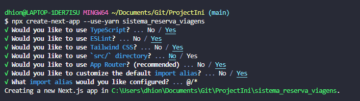

# Project SRV
#### Instruções executadas:
*  Instalando nextjs versão 13
```
npx create-next-app --use-yarn sistema_reserva_viagens
``` 


* Instalando Prisma como dev dependencia
OBS: Navegar até a pasta do projeto: cd sistema ```cd sistema_reserva_viagens```

Instalando Prisma:
```
yarn add -D prisma
```

* Inicializando o prisma como postgre (datasource)
```
npx prisma init --datasource-provider postgresql
```
* Adicionando prettier
```
yarn add -d prettier
```
* Fazendo a Migration no banco:
```
npx prisma migrate dev --name init
```

Erro ao encontrar o prismaclient execute
```
yarn add @prisma/client
```
Instalando next-auth
```
yarn add next-auth 
```
Instalando dependencia que adapta o next auth ao prisma:
```
yarn add @auth/prisma-adapter
```
Instalando icones react:
```
 yarn add react-icons
```

Instalando tailwind merge
```
yarn add tailwind-merge
```

Instalando datePicker e Date fns:
```
yarn add react-datepicker date-fns
```
Para fazer com que o typescript reconheça o datepicker é preciso instalar o type: 
```
 yarn add -D @types/react-datepicker
```

Instalando currency input para tratar campos com real
```
yarn add react-currency-input-field
```
Alteração no banco de dados:
Formater o doc do prisma com o comando
```
npx prisma format
```
Rodando a migration
```
npx prisma migrate dev --name add_country_code_and_recomended
```
adicionando bandeira de paises com react country flag:
```
yarn add react-country-flag
```